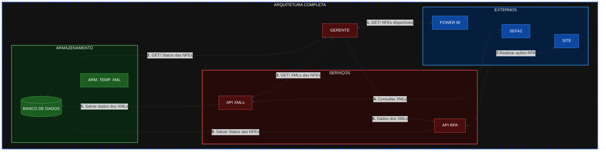

# Automação para processo de criação de reservas
- ## Diagrama detalhado de ações do usuário

- ## Arquitetura Global
## **Criação de RPA** - Automação de criação de Reservas
- ### Descrição da aplicação

- ### Ferramentas utilizadas e Pré-Requisitos Globais
    - [TypeScript](https://www.typescriptlang.org/)
    >Linguagem de programação, baseada em JavaScript, utiliziada juntamente com node.js.
    - [Node.js](https://nodejs.org/pt-br)
    >Compilador de javascript, tem como finalidade executar código JS no lado do servidor, que é compilado pelo motor V8 do chrome.
    - [Nest.js](https://nestjs.com/)
    >Framework para facilitar a criação de APIs e WebHooks, e possui muitas outras finalidades, como a aplicação de injeção de dependências.
    - [Playwright](https://playwright.dev/docs/input)
    >Biblioteca da Microsoft para criação de teste automatizados, assim como o selenium, também cria RPAs.

## **Criação de API** - Busca de XMLs
- ### Descrição da aplicação
- ### Ferramentas utilizadas e Pré-Requisitos Globais

