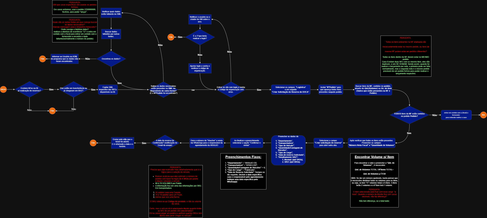
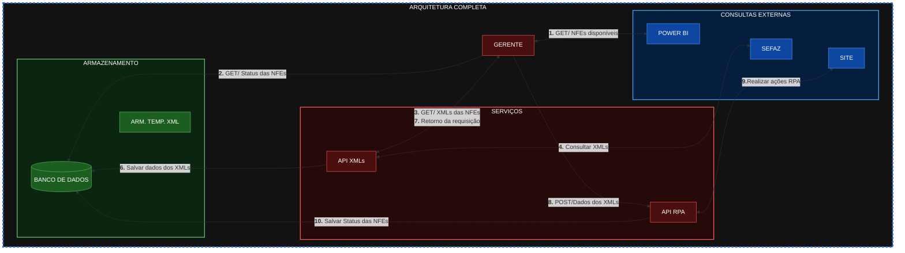

# Automação para processo de criação de reservas
## Objetivos e Arquitetura do projeto
- ## Descrição do projeto
    - Para esse projeto temos como objetivo automatizar o processo de automação de criação de reservas e para isso é necessário:

        1. Busca das NFEs disponíveis para a abertura de reserva;
        2. Busca do XML correspondente ao código da NFE;
        3. Com esses dados em mãos criar a reserva no site específico utilizando o RPA.
        
        > Durante esses processos o objetivo é salvar os XMLs em um banco local até o final do processo para caso seja necessário a reutilização da nota, ela esteja disponível.
    
- ## Diagrama detalhado de ações do usuário

- ## Diagrama da Arquitetura Global

## **Criação de RPA** - Automação de criação de Reservas
- ### Descrição da aplicação
    Responsável pela automação do processo de criação de reservas no site vitge - cliente **ARUAJO**.
- ### Ferramentas utilizadas e Pré-Requisitos Globais
    | Ferramenta | Descrição Ferramenta |
    |:-----------|:---------------------|
    |[TypeScript](https://www.typescriptlang.org/)| Superset do JavaScript que adiciona tipagem estática e recursos modernos, aumentando a segurança e escalabilidade do código. |
    |[Node.js](https://nodejs.org/pt-br)| Ambiente de execução JavaScript assíncrono, baseado no motor V8 do Chrome, que permite a execução de código no lado do servidor. |
    |[NestJS](https://nestjs.com/)| Framework progressivo para Node.js focado em modularidade e injeção de dependências, facilitando a criação de aplicações escaláveis e testáveis. |
    |[Playwright](https://playwright.dev/)| Biblioteca da Microsoft para automação de navegadores (Chromium, Firefox e WebKit) através de uma API unificada, ideal para criação de RPAs robustos. |
    |[Prisma ORM](https://www.prisma.io/)| ORM (Object-Relational Mapper) de próxima geração para Node.js e TypeScript, que simplifica a manipulação do banco de dados com total segurança de tipos. |
    |[Dotenv](https://www.npmjs.com/package/dotenv)| Módulo para carregar variáveis de ambiente de um arquivo `.env` para o `process.env`, essencial para gerenciar credenciais de acesso de forma segura. |
    |[Docker](https://www.docker.com/)| Plataforma de conteinerização que permite empacotar a aplicação e suas dependências, garantindo que o RPA rode de forma idêntica em qualquer ambiente. |

## **API NF-e** - Captura de XMLs
- ### Descrição da aplicação
    Responsável pela busca dos XMLs correspondentes as NFs que serão disponibilizadas para esta aplicação atravez de comunicação HTTP.
- ### Ferramentas utilizadas e Pré-Requisitos Globais
    | Ferramenta | Descrição Ferramenta |
    |:-----------|:---------------------|
    |[Java 21](https://www.oracle.com/java/)| Linguagem de programação robusta e de alta performance, utilizada para o desenvolvimento do core da aplicação e lógica de orquestração. |
    |[Spring Boot 3](https://spring.io/projects/spring-boot)| Framework para facilitar a criação de aplicações Java autossuficientes, com configuração automática e servidor Tomcat embarcado. |
    |[Spring Data JPA](https://spring.io/projects/spring-data-jpa)| Abstração para persistência de dados que simplifica o acesso ao banco de dados e as operações de CRUD através do Hibernate. |
    |[PostgreSQL](https://www.postgresql.org/)| Sistema de gerenciamento de banco de dados relacional (SGBD) focado em integridade de dados e conformidade com padrões SQL. |
    |[OpenFeign](https://spring.io/projects/spring-cloud-openfeign)| Cliente HTTP declarativo utilizado para realizar as requisições de consulta ao Power BI e aos WebServices da SEFAZ de forma simplificada. |
    |[Java-Dotenv](https://github.com/cdimascio/dotenv-java)| Biblioteca para o gerenciamento de variáveis de ambiente (.env), garantindo a segurança de credenciais, certificados e chaves de acesso. |
    |[Maven](https://maven.apache.org/)| Gerenciador de dependências e automação de build, padronizando o ciclo de vida do desenvolvimento e compilação do projeto. |

## **API de Gerenciamento** - Controle das APIs e Consultas (Em Desenvolvimento)
- ### Descrição da aplicação
    Controle das aplicação de acordo com cada ação e reação.
- ### Ferramentas utilizadas e Pré-Requisitos Globais
    | Ferramenta | Descrição Ferramenta |
    |:-----------|:---------------------|
    |[Java 21](https://www.oracle.com/java/)| Linguagem de programação robusta e de alta performance, utilizada para o desenvolvimento do core da aplicação e lógica de orquestração. |
    |[Spring Boot 3](https://spring.io/projects/spring-boot)| Framework para facilitar a criação de aplicações Java autossuficientes, com configuração automática e servidor Tomcat embarcado. |
    |[Spring Data JPA](https://spring.io/projects/spring-data-jpa)| Abstração para persistência de dados que simplifica o acesso ao banco de dados e as operações de CRUD através do Hibernate. |
    |[PostgreSQL](https://www.postgresql.org/)| Sistema de gerenciamento de banco de dados relacional (SGBD) focado em integridade de dados e conformidade com padrões SQL. |
    |[OpenFeign](https://spring.io/projects/spring-cloud-openfeign)| Cliente HTTP declarativo utilizado para realizar as requisições de consulta ao Power BI e aos WebServices da SEFAZ de forma simplificada. |
    |[Java-Dotenv](https://github.com/cdimascio/dotenv-java)| Biblioteca para o gerenciamento de variáveis de ambiente (.env), garantindo a segurança de credenciais, certificados e chaves de acesso. |
    |[Maven](https://maven.apache.org/)| Gerenciador de dependências e automação de build, padronizando o ciclo de vida do desenvolvimento e compilação do projeto. |

